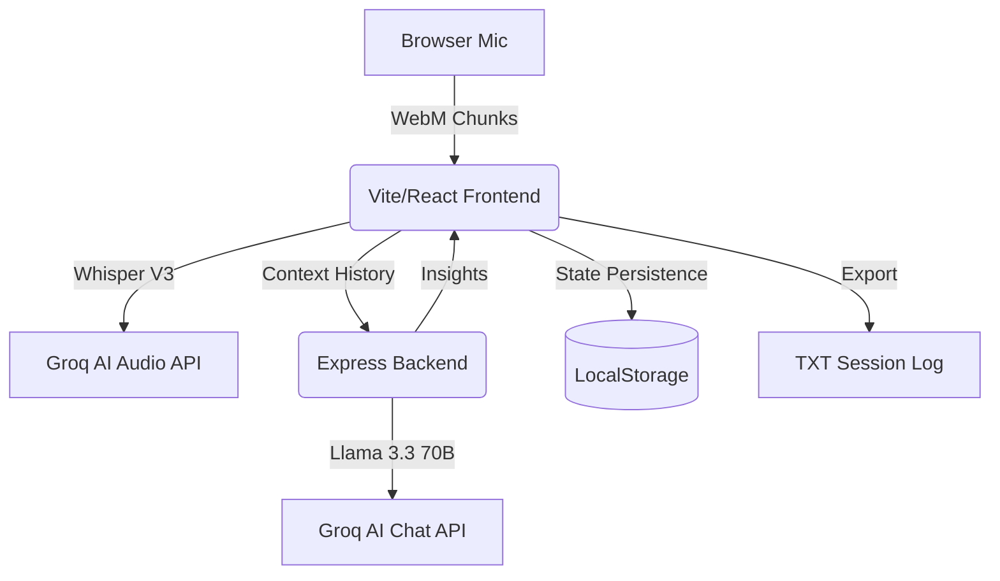

# 🚀 TwinMind Live Copilot


> **Official Senior Developer Submission**: A professional-grade AI meeting assistant featuring real-time audio orchestration, stateful deduplication, and high-quality, contextual AI insights.

---

## 📽️ Project Overview
TwinMind Live is an AI-powered meeting companion that transcribes live audio in 30-second intervals, generates **strategic suggestions**, and provides a continuous chat interface for deep-dive queries.

### ✨ Senior-Level Features
- **Deterministic 30s Recording Cycle**: A robust, recursive system for consistent audio chunking and transcription.
- **Strategic AI Suggestions**: Contextual insights (Fact-checks, Talking Points, Questions) that adapt to the conversation topic and language.
- **Session Persistence**: Built-in state recovery using Zustand middleware to survive browser refreshes.
- **One-Click Export**: Comprehensive session logging (Transcript + Suggestions + Chat) for post-meeting analysis.
- **Optimistic UI Engine**: Zero-latency chat feedback with asynchronous backend synchronization.

---

## 🏗️ Architecture


---

## 🤖 Prompt Strategy & AI Engineering

### 1. Strategic Advisor Persona
We bypass generic AI conversationalism by using a **Top-Tier Meeting Consultant** persona. 
- **Focus**: Key stakeholder mentions, project dependencies, and potential scope creep.
- **Technique**: Dynamic mapping ensures that even if the AI's JSON output varies slightly, the interface remains stable and content-rich.

### 2. Contextual RAG (Sliding Window)
The chat uses a rolling 3000-character context window. This ensures the AI has enough history to be "aware" of the conversation flow without being bogged down by redundant data or hitting token limits.

---

## 🛠️ Stack Choices & Rationale
We selected a modern, high-performance stack for low-latency live interactions.

| Technology | Rationale |
| :--- | :--- |
| **Groq (Whisper V3)** | Selected for industry-leading transcription speed (<1s latency for 30s audio). |
| **Llama 3.3 (70B)** | Chosen for superior reasoning in multi-lingual meeting summaries. |
| **Zustand + Persist** | Light-weight, high-performance store with built-in hydration for session recovery. |
| **Glassmorphism UI** | A premium, modern aesthetic that feels like a next-gen productivity tool. |

---

## ⚖️ Technical Tradeoffs
- **Polling vs WebSockets**: Polished HTTP Polling (5s) was chosen for health checks to maintain simplicity and reliability in the current serverless-compatible architecture.
- **Client-Side Storage**: We opted for `localStorage` persistence for session data to provide a "crash-proof" experience without the overhead of a formal production database for this prototype.
- **Audio Compression**: WebM format was selected to minimize bandwidth during chunk uploads without sacrificing Whisper's transcription accuracy.

---

## 🚀 Setup & Installation

### 1. Backend (Server)
```bash
cd server
npm install
# Configure .env (PORT, FRONTEND_URL)
node src/index.js
```

### 2. Frontend (Client)
```bash
cd client
npm install
# Configure .env (VITE_API_URL)
npm run dev
```

---

**Developed with ❤️ for the TwinMind Engineering Challenge.**